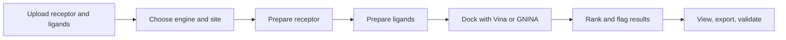

# StrataDock

<p align="center">
  <b>A Linux-first molecular docking workstation for fast, reproducible receptor-ligand screening.</b>
</p>

<p align="center">
  <a href="https://github.com/prithvirajanR/StrataDock"></a>
  
  
  
</p>

<p align="center">
  <a href="#quick-start">Quick Start</a>
  ·
  <a href="#workflow">Workflow</a>
  ·
  <a href="#features">Features</a>
  ·
  <a href="#validation">Validation</a>
  ·
  <a href="#deep-dive">Deep Dive</a>
</p>

---

StrataDock turns protein and ligand files into ranked docking results with preparation, pocket detection, Vina/GNINA docking, ADMET-style profiling, 3D viewing, reports, and session exports in one repeatable flow.

It is built for the normal messy case: a user has receptor `.pdb` files and ligand files, but often no reference ligand or polished docking setup.

## Quick Start

```bash
git clone https://github.com/prithvirajanR/StrataDock.git
cd StrataDock
bash setup_ubuntu.sh
bash run_stratadock.sh
```

Open:

```text
http://localhost:8502
```

If WSL/browser routing acts weird, use:

```text
http://127.0.0.1:8502
```

## What You Get

| Area | What StrataDock Handles |
| --- | --- |
| Receptors | PDB cleanup, water/hetero handling, receptor reports, PDBQT prep |
| Ligands | SDF, SMILES/TXT, ZIP libraries, 3D embedding, salts/protonation options, PDBQT prep |
| Binding sites | Reference ligand boxes, manual boxes, fpocket predicted pockets |
| Docking | AutoDock Vina by default, GNINA CPU/CUDA optional |
| Results | Scores, warnings, ADMET-style profile, binding-site summary, 3D viewer |
| Exports | CSV, JSON, HTML, PDF, PyMOL, 3Dmol viewer HTML, full session ZIP |
| Validation | Bundled redocking cases and setup smoke tests |

## Workflow



The app itself follows the original StrataDock flow:

```text
01. Upload -> 02. Settings -> 03. Run -> 04. Results -> 05. Help
```

## Features

### Docking Engines

| Engine | Best For | Notes |
| --- | --- | --- |
| AutoDock Vina | Reliable CPU-first docking | Default path, works well on Ubuntu/WSL |
| GNINA CPU | CNN scoring without NVIDIA hardware | Slower, but available on CPU |
| GNINA CUDA | NVIDIA GPU acceleration | Optional, requires compatible NVIDIA/CUDA setup |

AMD GPUs are detected and explained, but official GNINA GPU acceleration is CUDA/NVIDIA-based. On AMD machines, use Vina or GNINA CPU mode.

### Binding-Site Modes

| Mode | Use When |
| --- | --- |
| Reference ligand | You have a known co-crystal/reference ligand |
| fpocket | You only have a protein and need predicted pockets |
| Manual box | You already know center/size coordinates |

fpocket is important for real users who do not have reference ligands. StrataDock can dock across the top predicted pockets instead of pretending pocket 1 is always correct.

### Result Intelligence

StrataDock does not just dump raw scores. It also:

- ranks poses and ligands
- flags unfavorable non-negative docking scores
- flags ADMET-style rule failures
- summarizes predicted pockets
- writes reproducible run manifests
- keeps downloadable artifacts organized by run

## Validation

The repo includes five bundled validation systems:

| Case | Target |
| --- | --- |
| `hiv_protease_1hsg` | HIV protease |
| `egfr_1m17` | EGFR |
| `abl_kinase_1iep` | ABL kinase |
| `trypsin_3ptb` | Trypsin |
| `hsv_tk_1kim` | HSV thymidine kinase |

Run the full validation suite after setup:

```bash
python scripts/validation/run_validation_all.py
```

Run tests:

```bash
python -m pytest -q
```

Some integration tests are skipped in a fresh clone until runtime binaries or generated run artifacts exist. `setup_ubuntu.sh` installs/downloads the required docking tools.

## Install Philosophy

The installer is intentionally one command:

```bash
bash setup_ubuntu.sh
```

It creates/repairs `.venv`, installs Python dependencies, prepares fpocket, downloads Vina and GNINA, verifies the environment, and writes the launcher.

No manual "go install ten random things" workflow should be needed for normal Ubuntu/WSL use.

## Project Layout

```text
StrataDock/
  streamlit_app.py              # Streamlit UI
  setup_ubuntu.sh               # Linux/WSL installer
  run_stratadock.sh             # generated/usable launcher
  src/stratadock/core/          # docking, prep, reports, pockets, ADMET
  src/stratadock/ui/            # UI helpers
  src/stratadock/tools/         # binary resolution helpers
  scripts/user/                 # CLI utilities
  scripts/validation/           # validation runners
  scripts/install/              # installer helpers
  data/validation/              # bundled validation cases
  tests/                        # unit and integration tests
```

## Command Line Tools

StrataDock can be used from the UI or from scripts.

```bash
python scripts/user/run_single.py --help
python scripts/user/run_batch.py --help
python scripts/user/suggest_pockets.py --help
python scripts/user/inspect_receptor.py --help
python scripts/user/download_pdb.py --help
```

## Deep Dive

The sections below keep the repo homepage clean while preserving the details needed for real use.

<details>
<summary><b>Supported inputs</b></summary>

### Receptors

Supported receptor input:

- `.pdb`

### Ligands

Supported ligand input:

- `.sdf`
- `.smi`
- `.smiles`
- `.txt`
- `.zip` containing supported ligand files

If you have multiple SDF files, put them into a `.zip` and upload the archive.

</details>

<details>
<summary><b>Docking settings</b></summary>

### Vina settings

Fast smoke-test settings:

```text
exhaustiveness = 1-2
num_modes = 1
```

Reasonable first-pass settings:

```text
exhaustiveness = 8
num_modes = 9
seed = 1
```

Increase exhaustiveness for slower final checks.

### GNINA settings

GNINA can output:

- affinity score
- CNNscore
- CNNaffinity

GNINA CPU mode works without an NVIDIA GPU. GNINA CUDA mode is only for compatible NVIDIA/CUDA systems.

</details>

<details>
<summary><b>Binding-site guidance</b></summary>

### Reference ligand mode

Use this when you have a co-crystal ligand or known ligand coordinates. This is usually the most reliable validation/redocking mode.

### fpocket mode

Use this when you only have a protein and ligands. StrataDock predicts geometric pockets and can dock across top-ranked pockets.

Practical defaults:

- top 3 pockets for normal screening
- top 5 pockets when missing the correct site is worse than extra runtime/noise

Important caution:

- fpocket rank is not proof of biological relevance
- bad pockets can produce poor or positive scores
- always inspect top-ranked poses visually when results matter

### Manual box mode

Use this when reproducing known docking coordinates or expert-selected binding sites.

</details>

<details>
<summary><b>Positive docking scores</b></summary>

A positive Vina docking score is not a crash. It means docking completed, but the returned pose is energetically unfavorable.

StrataDock flags these rows as:

```text
unfavorable_score
```

Treat positive scores as low-confidence or bad poses unless you have a very specific reason not to.

</details>

<details>
<summary><b>Outputs</b></summary>

Each run writes a clean run folder with artifacts such as:

- `results.csv`
- `results.json`
- `best_by_ligand.csv`
- `best_by_pocket.csv`
- `run_summary.txt`
- `manifest.json`
- receptor preparation reports
- prepared ligand files
- pose PDBQT files
- complex PDB files
- interaction CSV/JSON files
- viewer HTML files
- PyMOL scripts
- PDF/HTML reports
- session ZIP exports

</details>

<details>
<summary><b>Troubleshooting</b></summary>

### Port 8502 is busy

Run on another port:

```bash
STRATADOCK_PORT=8503 bash run_stratadock.sh
```

### apt is locked

Ubuntu may be running unattended upgrades. The installer waits for normal package-manager locks. Do not delete dpkg lock files manually.

### fpocket is not available through apt

That is normal on some Ubuntu installs. The setup script can build/install fpocket instead of relying on the package repository.

### GNINA GPU is not available

GNINA GPU acceleration needs NVIDIA/CUDA. Use GNINA CPU or Vina on CPU-only or AMD systems.

### Fresh clone tests skip integration cases

Some tests require downloaded runtime binaries or generated validation poses. Run setup first:

```bash
bash setup_ubuntu.sh
python -m pytest -q
```

</details>

## Notes

StrataDock is a docking workflow tool, not a biological truth machine. Scores and predicted pockets are screening signals. Important hits should be checked with domain knowledge, visual inspection, repeat docking settings, and stronger downstream validation.
